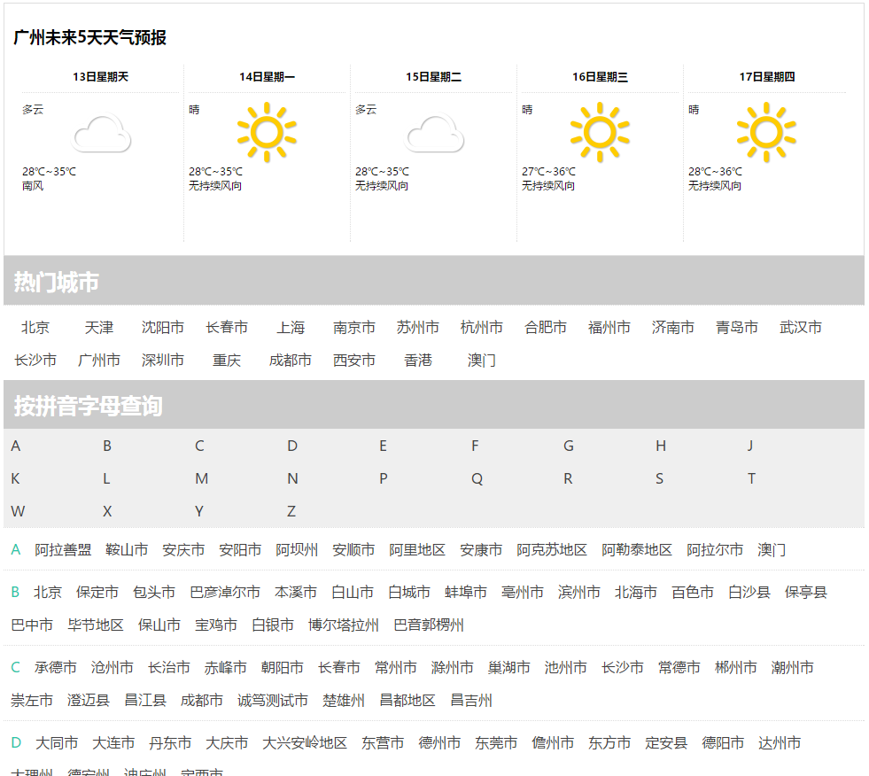

[TOC]

#Ajax

##了解AJAX
* AJAX: Asynchronous Javascript And Xml，Ajax 技术的核心是XMLHttpRequest对象（简称XHR），这是由微软首先引入的一个特性，其他浏览器提供商后来都提供了相同的实现

*Ajax起源：
最早出现在2005年的google搜索建议

* ajax优点
    - 增加速度：减轻服务器的负担,按需加载数据,最大程度的减少冗余请求
    - 改善的用户体验：局部刷新页面,减少用户等待时间,带来更好的用户体验
    - 页面和数据分离：前后端分离，操作更灵活，后期维护更方便

* 后端语言和服务器配置
    - php + Apache + mySQL
    - NodeJS + MongoDB
    - Java + tomcat + Oracle
    - .NET + IIS + SQL Server

##AJAX请求步骤
1. 创建请求对象,返回一个异步请求对象
`var xhr = new XMLHttpRequest();`

4. 处理服务器返回数据
```javascript
xhr.onreadystatechange = function(){
    if(xhr.readyState == 4) {
        alert(xhr.responseText);
    }
}
```

2. 设置请求参数，建立与服务器连接
`xhr.open("get", "http://localhost/api/ajaxtest", true);`

3. 向服务器发送请求
`xhr.send(null);`
        
##XMLHttpRequest对象属性方法
* open(type,url,async): 建立与服务器的连接
    - type：请求的类型 （get, post, put, delete...）
    - url：数据请求的地址（API地址），一般由后端开发人员提供
        + 当前页面访问地址，API地址两者一定要**同域**
        + 同域：协议，域名，端口三者一致（同源策略）

    - async：是否异步发送请求（true,false），默认为true
        + 同步：按步骤顺序执行，前面的代码执行完后，后面的代码才会执行
        >做完前一件事情, 才能下一件事情（排队）
        + 异步：与其他操作同时执行，也叫并发（图片加载，ajax请求）

* send(data): 向服务器发送请求
    - data：可选参数，post请求时才生效，表示发请求时传送的数据字符串。
    ```javascript
        xhr.send('size=20&type=music');
    ```
    >在某些浏览器中，如果不需要通过请求主体发送数据，则必须传入null
    
    - get请求的数据写在api地址后
    ```
        request.open("get", "http://localhost/api/getdata.php?type=get&qty=10", true);
    ```

* setRequestHeader(key,val)：设置请求头
    - 设置请求头必须在open方法调用后设置
>利用请求头设置POST提交数据格式：
xhr.setRequestHeader('content-type',"application/x-www-form-urlencoded");

>**在请求收到服务器的响应后，响应的数据会自动填充xhr 对象的属性，相关的属性简介如下：

* readyState
    - 0 － （未初始化）尚未调用open()方法。
    - 1 － （启动）已经调用open()方法，但尚未调用send()方法。
    - 2 － （发送）send()方法执行完成，但尚未接收到响应。
    - 3 － （接收）已经接收到部分响应数据。
    - 4 － （完成）响应内容解析完成，可以在客户端调用了

>只要readyState 属性的值由一个值变成另一个值，都会触发一次readystatechange 事件。必须在调用open()之前指定onreadystatechange事件处理程序才能确保跨浏览器兼容性。

* responseText：保存服务器返回的数据（从服务器返回的数据是“字符串”）。
* status：响应的HTTP 状态。
    - 200（OK）：服务器成功返回了页面
    - 304（Not Modified）：数据与服务器相同，不需要重服务器请求（直接使用缓存的数据）
    - 400（Bad Request）：语法错误导致服务器不识别
    - 401（Unauthorized）：请求需要用户认证
    - 404（Not found）：请求地址不存在
    - 500（Internal Server Error）：服务器出错或无响应
    - 503（ServiceUnavailable）：由于服务器过载或维护导致无法完成请求
* statusText: HTTP状态码的说明


###XMLHttpRequest的兼容性（了解）
```javascript
var req = null;
try{
    req = new XMLHttpRequest();
}catch(err){
    // ie低版本浏览有多种异步请求的实现
    try{
        req = new ActiveXObject("Msxml2.XMLHTTP");
    }catch(err){
        try{
            req = new ActiveXObject("Microsoft.XMLHTTP");
        }catch(err){
            alert('你的浏览器太low了，这个世界不适合你');
        }
    }
    
}

```

##JSON数据的应用
* xml数据（了解）
```xml
<person>
    <id>4564523626256562</id>
    <name>张三</name>
</person>
```

* json数据(json字符串)
```javascript
    {"id" : 21465461461461, "name": "张三"},[{"id" : 21465461461461, "name": "张三"}]
```
    - json数据格式要求
    - json字符串的转换
        + eval方法转换
        `eval("("+json字符串+")");` 
        它的作用是，将一个普通的json格式的字符串，转换成Json格式的对象
        举例：
        ```javascript
            var list = eval("("+request.responseText+")");
        ```
        + JSON对象(ES5)
            * JSON.parse(); //把JSON字符串转成JSON对象(js对象/数组)
            * JSON.stringify(); //把JSON对象转成JSON字符串

* 加载json文件
前后端分离开发时模拟数据


##ajax跨域解决方案

###JSONP
JSONP 是JSON with padding（填充式JSON 或参数式JSON）的简写。
JSONP是一种可以绕过浏览器的安全限制，从不同的域请求数据的方法。使用JSONP需要服务器端提供必要的支持。
```php
callback({ "name": "Nicholas" });//此代码在服务器生成
```

>JSONP 由两部分组成：回调函数和数据。回调函数是当响应到来时应该在页面中调用的函数

####jsonp请求原理
* JSONP的原理是通过script标签发起一个GET请求来取代XHR请求。
    - JSONP生成一个script标签并插到DOM中，
    - 然后浏览器会接管并向src属性所指向的地址发送请求。
    - 从服务器端返回一段js代码，这段代码就是一个函数的执行（执行时把数据作为参数传入，函数为本地预定义的函数）,这个我们就间接地得到了服务器传出的数据。
    
* 步骤如下：
    1. 预定义全局函数getData
    ```javascript
    function getData(data){
        console.log(data);
    }
    ```
    >PS:预定义函数必须为全局函数
        
    2. 生成script标签，请求服务器地址,并附带函数名
    ```
    <script src="http://localhost:3000/getJSONP?callback=getData">< /script>
    ```
    3. 服务器返回js文件（js文件里面包含我们预先定义的函数执行）
    请求成功后，得到的js代码为
    ```javascript
    getData({name: '王大锤',age: 30,sex: '男',married:false})
    ```
    当这个函数成功调用时，就可以执行预定义函数里的代码（处理返回的数据）

>jsonp请求不是ajax请求，是利用script标签能加载其他域名的js文件的原理，来实现跨域数据的请求

* 缺点
这种方法只支持GET方式，不如POST方式安全

###CORS
CORS是一个W3C标准，全称是"跨域资源共享"（Cross-origin resource sharing），它允许浏览器向跨源服务器发出XMLHttpRequest请求，从而克服了AJAX只能同源使用的限制
>CORS需要浏览器和服务器同时支持。目前，所有浏览器都支持该功能，IE浏览器不能低于IE10。

* Access-Control-Allow-Origin
该字段是必须的。需要在后端响应头添加词字段，值要么是一个*，表示接受任意域名的请求，要么指定一个域名`http://localhost`,如想指定若干个请使用判断语句，php代码如下
```php
    $origin = $_SERVER['HTTP_ORIGIN'];
    
    $allow_origin = array(  
        'http://www.client.com',  
        'http://www.client2.com'  
    );  
      
    if(in_array($origin, $allow_origin)){  
        header('Access-Control-Allow-Origin:'.$origin);  
    }  
```
* Access-Control-Allow-Methods
* Access-Control-Allow-Headers
```php
    header('Access-Control-Allow-Methods:POST');  
    header('Access-Control-Allow-Headers:x-requested-with,content-type'); 
```

###服务器代理
后端不存在跨域问题，所以可以利用后端间接获取其他网站的数据

##Promise
Promise是一个构造函数，所谓的Promise对象，就是通过new Promise()实例化得到的对象，用来传递异步操作的消息。它代表了某个未来才会知道结果的事件（通常是一个异步操作），并且这个事件提供统一的 API，可供进一步处理。

###Promise 的三种状态
* Pending（未完成）可以理解为Promise对象实例创建时候的初始状态
* Resolved（成功） 可以理解为成功的状态
* Rejected（失败） 可以理解为失败的状态

###方法
####静态方法
* `Promise.resolve()`
将现有对象转为Promise对象，并将该对象的状态改成resolved
```javascript
var p = Promise.resolve('foo');

// 等价于
var p = new Promise(resolve => resolve('foo'));
```
* `Promise.reject()`
返回一个新的 Promise 实例，该实例的状态为rejected
* `Promise.all([p1,p2,p3...])` 
将多个Promise实例，包装成一个新的Promise实例
    - 所有参数中的promise状态都为resolved是，新的promise状态才为resolved
    - 只要p1、p2、p3..之中有一个被rejected，新的promise的状态就变成rejected
* `Promise.race([p1,p2,p3...])` // 竞速，完成一个即可

####原型方法
* `Promise.prototype.then(successFn[,failFn])`
Promise实例生成以后，可以用then方法分别指定Resolved状态和Rejected状态的回调函数。并根据Promise对象的状态来确定执行的操作:
    - resolved时执行第一个函数successFn
    - rejected时执行第二个函数failFn。
* `Promise.prototype.catch(failFn)`

###使用
```javascript
    var p = new Promise(function(resolve, reject){
        //ajax请求
        ajax({
            url:'xxx.php',
            success:function(data){
                resolve(data)
            },
            fail:function(){
                reject('请求失败')
            }
        });
    });

    //指定Resolved状态和Rejected状态的回调函数
    //一般用于处理数据
    p.then(function(res){
        //这里得到resolve传过来的数据
    },function(err){
        //这里得到reject传过来的数据
    })
```
Promise的构造函数接收一个回调函数作为参数，并且传入两个参数：resolve，reject，分别表示异步操作执行成功和失败后的回调函数

* 调用resolve方法将Promise对象的状态从「未完成」变为「成功」（从 pending 变为 resolved）；
* 调用reject方法将Promise对象的状态从「未完成」变为「失败」（从 pending 变为 rejected）
* 如果调用resolve函数和reject函数时带有参数，那么它们的参数会被传递给回调函数

>有了Promise对象，就可以将异步操作以同步操作的流程表达出来，避免了层层嵌套的回调函数

###应用
* 加载图片，获取图片信息（宽高）
```javascript
    var preloadImage = function (path) {
      return new Promise(function (resolve, reject) {
        var image = new Image();
        image.onload  = ()=>{
            resolve(image);
        }
        image.onerror = reject;
        image.src = path;
      });
    };

    //使用
    preloadImage('http://image.baidu.com/xxx.jpg').then((img)=>{
        document.body.appendChild(img);
        console.log(img.offsetWidth,img.offsetHeight);
    })
```
* 多个ajax请求数据依赖


##API
    
* 本地服务器API
    - 判断用户名是否已被注册
        + 接口地址：api/checkname.php
        + 接口描述：验证所提交的用户名是否存在
            * 已存在（不可注册）：返回no
            * 不存在（可注册）：返回yes
        + 参数说明：
            + regname:注册用户名（必填）
        >已经存在的名字：'laoxie','lemon','王尼玛','奥巴马'

    - 微博消息
        - 获取：
            * 接口地址：api/weibo.php
            * 接口描述：返回包含多条微博记录的json数据
         + 点赞：
            * 接口地址：api/weibo.php
            * 接口描述：点赞数量+1
            * 参数说明：
                * id: 消息对应id（必填）

    - 分页获取数据：
        + 接口地址：api/football.php    
        + 接口描述：根据分页和每页数量请求多条微博信息的数据
        + 参数说明：
            - pageNo:当前分页，默认1
            - qty:每页显示数量，默认10

    - 聊天室：
        + 接口地址：api/chat.php
        + 接口描述：聊天室的发送与信息获取
        + 参数说明：
            - type
                + query: 获取聊天消息
                + send: 发送信息
            - sender: 发送信息用户名
            - msg: 信息内容


    - 利用jsonp获取远程数据
        + 接口地址：api/jsonp.php
        + 接口描述：jsonp跨域解决方案

    - 获取CORS获取远程数据
        + 接口地址：api/cors.php
        + 接口描述：CORS跨域解决方案

    - 获取ip地址
        + 本机内网ip地址：api/inner_ip.php
        + 利用服务器代理获取外网ip:api/outer_ip.php

* 跨域api
    - 利用jsonp实现百度搜索关键字建议
        `https://sp0.baidu.com/5a1Fazu8AA54nxGko9WTAnF6hhy/su?json=1&cb=getData&wd=html5`

    - 利用CORS加载天气
        接口地址：`http://wthrcdn.etouch.cn/weather_mini?city=北京`
        接口描述：通过城市名字获得天气数据，json数据

    - 利用服务器代理根据ip获取城市
        + 根据IP获取所在城市
    `http://ip.taobao.com/service/getIpInfo.php?ip=61.144.96.228`

---

【案例】

1. 滚动页面加载更（懒加载）
2. 封装ajax函数，要求如下：
    * 简化ajax请求操作
    * 解决兼容性问题
    * 支持跨域JSONP请求

**【作业】**

1. ajax请求json数据实现实现城市列表的展示
    * 显示热门城市
    * 支持字母索引
    * 点击城市显示相应天气信息
    

**【扩展】**

* 全国地市三级联动效果
